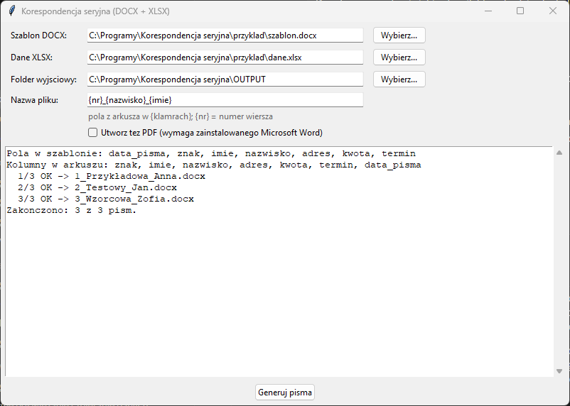

# Korespondencja seryjna (DOCX + XLSX)

Program **lokalny** — działa w całości na Twoim komputerze i nigdzie nie
wysyła danych. Z jednego szablonu pisma w Wordzie i listy adresatów
w Excelu tworzy osobne pismo dla każdego adresata: zawiadomienia, decyzje,
zaświadczenia, wezwania, podziękowania.



## Jak to działa

1. **Szablon DOCX.** Zwykły dokument Worda, w którym zmienne miejsca
   oznaczasz nazwą pola w klamrach: `{imie}`, `{nazwisko}`, `{adres}`,
   `{kwota}`.
2. **Dane XLSX.** Pierwszy wiersz pierwszego arkusza zawiera nazwy pól
   (bez klamer), a każdy kolejny wiersz to jedno pismo. Puste wiersze są
   pomijane.
3. Program wstawia wartości w miejsce pól i zapisuje osobny `.docx` dla
   każdego wiersza, a jeśli zaznaczysz tę opcję, także `.pdf`.

Przykład jest w folderze [`przyklad/`](przyklad/): `szablon.docx`
(zawiadomienie o opłacie) i `dane.xlsx` (3 fikcyjnych adresatów). Program
otwiera się z tymi plikami wpisanymi w pola, więc wystarczy kliknąć
**Generuj pisma**.

| szablon | arkusz | wynik |
|---------|--------|-------|
| `Szanowna Pani {imie} {nazwisko}` | `imie: Anna`, `nazwisko: Nowak` | `Szanowna Pani Anna Nowak` |

### Zasady

- **Formatowanie zostaje** (czcionka, pogrubienie, tabele). Wartość
  przejmuje wygląd miejsca, w którym stało pole. Pole może stać w treści,
  tabeli, nagłówku, stopce i polu tekstowym.
- **Wielkość liter w nazwach pól nie ma znaczenia**: `{Imie}` = `{imie}` =
  kolumna `IMIE`.
- **Adres w kilku liniach**: w komórce Excela przejdź do nowej linii
  (Alt+Enter), a w piśmie pojawi się złamanie wiersza.
- **Daty** z Excela są wpisywane jako `15.10.2026`.
- **Liczby** są wpisywane zgodnie z formatem komórki w Excelu. Format
  `0,00` daje `42,50`, format z separatorem tysięcy daje `1 234,50`.
  Przy formacie „Ogólny” program wpisze `42,5`.
- **`{nr}`** to numer wiersza (1, 2, 3…). Działa nawet bez takiej kolumny.
- Pola z szablonu, których nie ma w arkuszu, zostają w piśmie bez zmian,
  a w logu pojawia się ostrzeżenie. Program sprawdza to przed generowaniem.

### Nazwy plików

Pole **Nazwa pliku** przyjmuje te same `{pola}`, np. `{nr}_{nazwisko}_{imie}`
daje `1_Nowak_Anna.docx`. Znaki niedozwolone w nazwach plików są
zamieniane na `_`. Jeśli nazwy się powtarzają (np. to samo nazwisko),
kolejne pliki dostają końcówki `_2`, `_3`.

### PDF

Opcja **Utwórz też PDF** używa zainstalowanego **Microsoft Word**, więc PDF
wygląda dokładnie jak wydruk z Worda. Word jest uruchamiany raz na całą
serię, niewidocznie. Żeby dostać jeden plik do wydruku całej serii, połącz
PDF-y programem *Narzędzia PDF* (operacja **Połącz**).

## Instalacja (jednorazowo)

1. **Python** — pobierz z [python.org](https://www.python.org/downloads/windows/)
   (wersja 3.9 lub nowsza). W instalatorze zaznacz **„Add python.exe to PATH”**.
   Opcja „tcl/tk and IDLE” jest zaznaczona domyślnie i musi taka zostać.
   Uprawnienia administratora nie są potrzebne.
2. **Program** — na stronie [github.com/DawidBochno/Korespondencja-seryjna](https://github.com/DawidBochno/Korespondencja-seryjna)
   kliknij zielony przycisk **Code → Download ZIP**. Rozpakuj archiwum,
   np. do `C:\Programy\Korespondencja seryjna`. Nie uruchamiaj programu z wnętrza ZIP-a.
3. Kliknij dwukrotnie **`install.bat`**. Instaluje biblioteki `python-docx`, `openpyxl` i `pywin32` (potrzebny internet) i uruchamia test. Na końcu pojawia się
   **„selftest OK”**, co znaczy, że wszystko działa.
   Jeśli Windows pokaże „System Windows ochronił ten komputer”, kliknij
   **Więcej informacji → Uruchom mimo to**.
4. Program uruchamia się plikiem **`uruchom.bat`**. Wygodnie jest zrobić
   skrót na pulpicie: prawy przycisk na `uruchom.bat` → **Wyślij do →
   Pulpit (utwórz skrót)**.

## Jak używać

Najpierw wypróbuj program na gotowym przykładzie: pola w oknie są już
ustawione na pliki z folderu `przyklad/`.

1. Uruchom `uruchom.bat`.
2. **Szablon DOCX** — pismo w Wordzie z polami w klamrach, np. `{imie}`,
   `{kwota}` (zasady w sekcji [Jak to działa](#jak-to-działa)).
3. **Dane XLSX** — arkusz, w którym pierwszy wiersz zawiera nazwy pól,
   a każdy kolejny wiersz to jeden adresat.
4. **Folder wyjściowy** — tu powstaną pisma (domyślnie `OUTPUT`).
5. **Nazwa pliku** — wzór nazwy, np. `{nr}_{nazwisko}_{imie}`.
6. **Utwórz też PDF** — zaznacz, jeśli potrzebne są PDF-y (wymaga Worda).
7. Kliknij **Generuj pisma**. Log pokazuje pola znalezione w szablonie
   i kolumny arkusza, więc literówkę w nazwie pola widać od razu.

## Aktualizacje

Po uruchomieniu program sprawdza w tle na GitHubie, czy jest nowa wersja.
Jeśli jest, pyta **„Pobrać i zainstalować teraz?”**. Pobierane są tylko
zmienione pliki programu. Foldery `INPUT`, `OUTPUT`, ustawienia i pliki
w `przyklad/` nie są nadpisywane. Po aktualizacji zamknij i uruchom program ponownie. Jeśli program
o to poprosi, uruchom też raz `install.bat` (zmieniły się biblioteki).

- Do GitHuba trafia tylko zapytanie o listę plików programu, **nigdy
  dokumenty ani dane**.
- Bez internetu albo przy blokadzie (np. UTM) program działa normalnie,
  bez żadnego komunikatu.
- **Wyłączenie** (np. gdy programy aktualizuje dział IT): utwórz w folderze
  programu pusty plik o nazwie `NIE_AKTUALIZUJ`.
- Kopię pobraną przez `git clone` aktualizuje się poleceniem `git pull`.

## Ograniczenia

- Obsługiwany jest tylko pierwszy arkusz pliku XLSX. Format `.xls` trzeba
  najpierw zapisać jako `.xlsx`.
- Nie da się tworzyć warunków (np. „Pan/Pani” zależnie od płci). Dodaj
  w arkuszu kolumnę `{zwrot}` z gotowym tekstem.
- Opcja PDF wymaga Microsoft Word. Bez niego powstają same pliki DOCX.

## Testy

```bash
python korespondencja.py --selftest         # logika (bez Worda)
python korespondencja.py --selftest --pdf   # dodatkowo konwersja PDF przez Worda
```

Test sprawdza pole rozcięte przez Worda na kilka fragmentów formatowania,
pola w nagłówku i tabeli, adres wieloliniowy, daty, formaty liczb, pomijanie
pustych wierszy, nieznane pola i powtarzające się nazwy plików.
